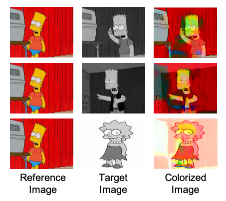

# Two-Unpaired-Images-Colorization
To colorize with two unpaired images using internal learning

For more detail, you can check out this [docs](https://drive.google.com/file/d/1VWvBLQLWPvABd86odnDPe0lbTkhd9kTJ/view?usp=sharing)

## Example Results
### Colorized Results
</img>

Generated images given a reference image and a target image.

## Usage
### Prerequisites
- Python 3.6
- Pytorch 1.8.0
- TorchVision 0.6.1
- scikit-image
- scikit-learn
- scipy
- numpy

### Getting Started
#### Installation
Clone this repo:
```bash
git clone https://github.com/SuhyeonHa/Two-Unpaired-Images-Colorization
cd Two-Unpaired-Images-Colorization
```
#### Dataset
you can use any pair of colored and grayscale image.
We used [The Simpsons Characters Data](https://www.kaggle.com/alexattia/the-simpsons-characters-dataset)

#### Model Training
#### Use a Pre-trained Model
